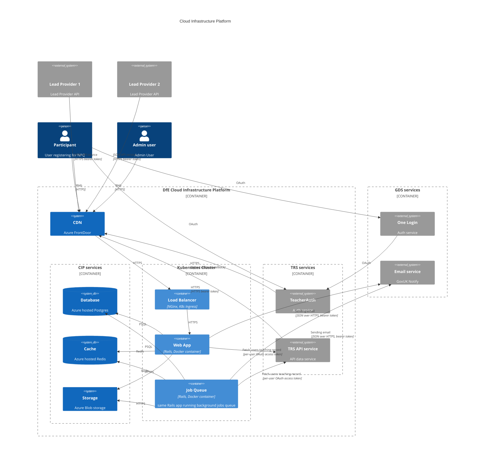

[< Back to Navigation](../README.md)

# C4 Container model

Internally we have web and worker Kubernetes containers nodes, with the web
containers accessed via a CDN backed onto an nginx kubernetes ingress. These are
backed by Azure managed Postgres, Redis and blob storage services.

Externally we integrate with
* the TeacherAuth service provided by the TRS service, which itself then integrates with the GOV.UK One Login service
* we provide certificate information to the TRS service via an internal API
* we request TRN allocation for new TeacherAuth users via a TRS API, via a per-user OAuth access token
* we are notified of user changes via signed webhooks we provide to TRS
* we send emails out using the GOV.UK Notify service

Below is a C4 Container diagram for the NPQ service

