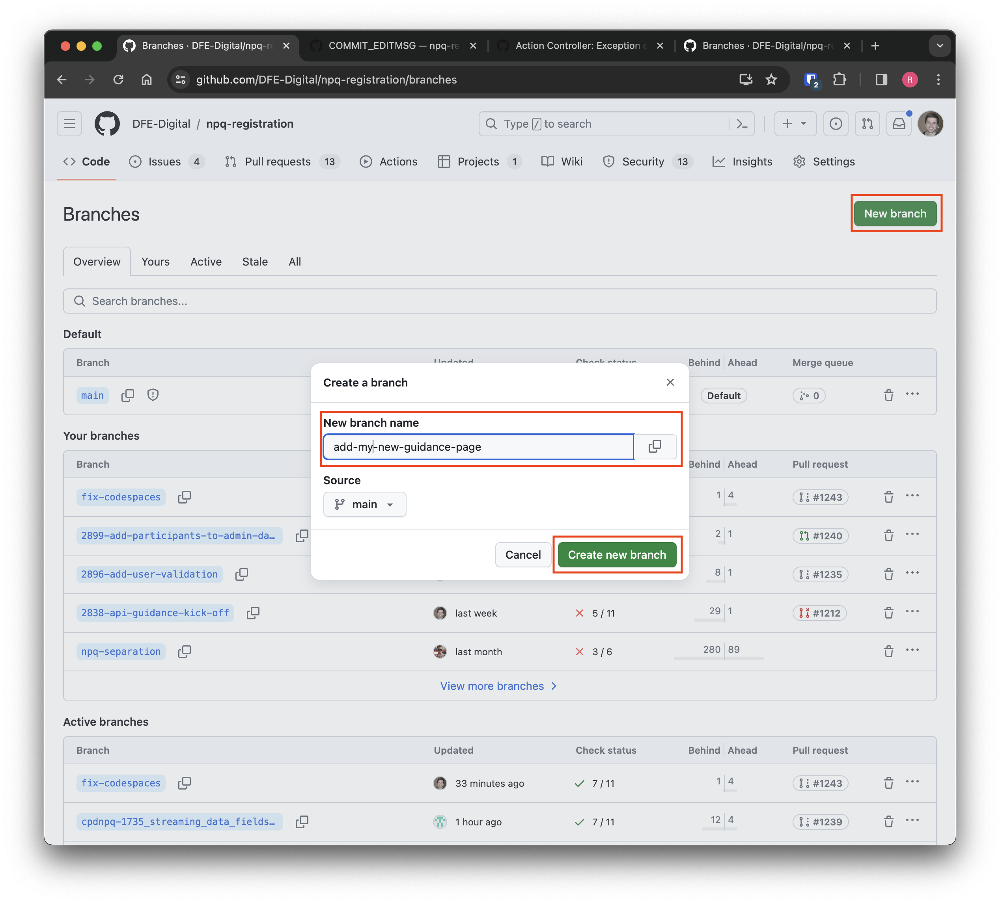
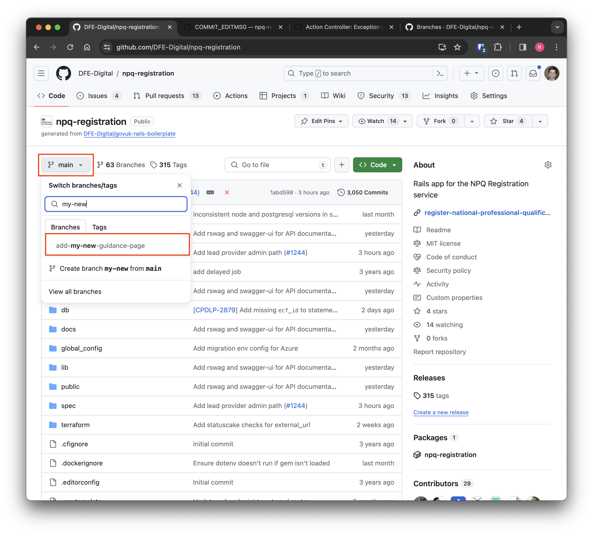
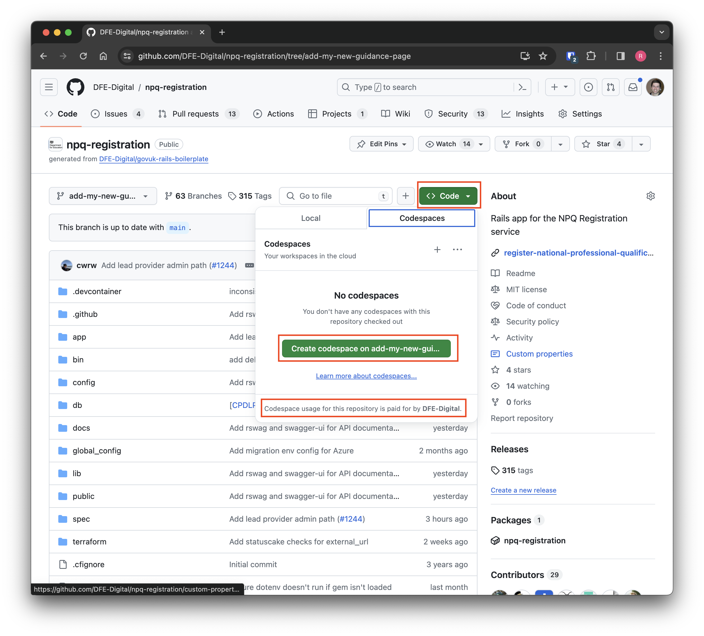
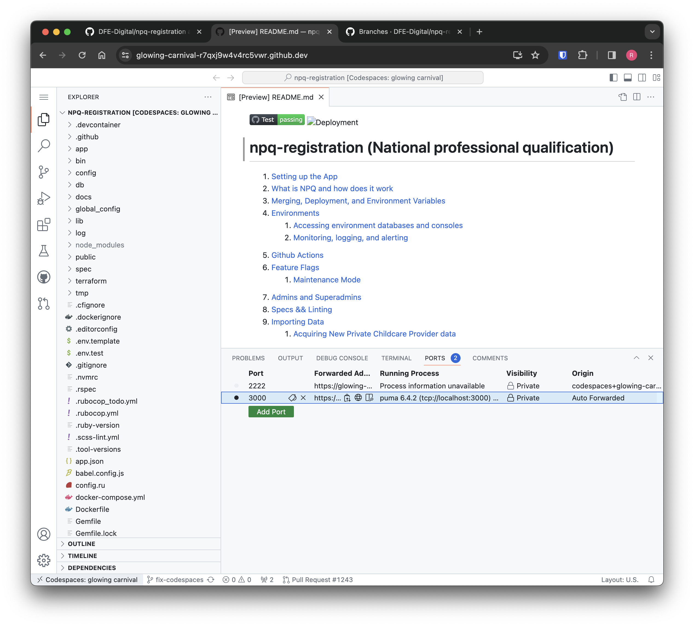
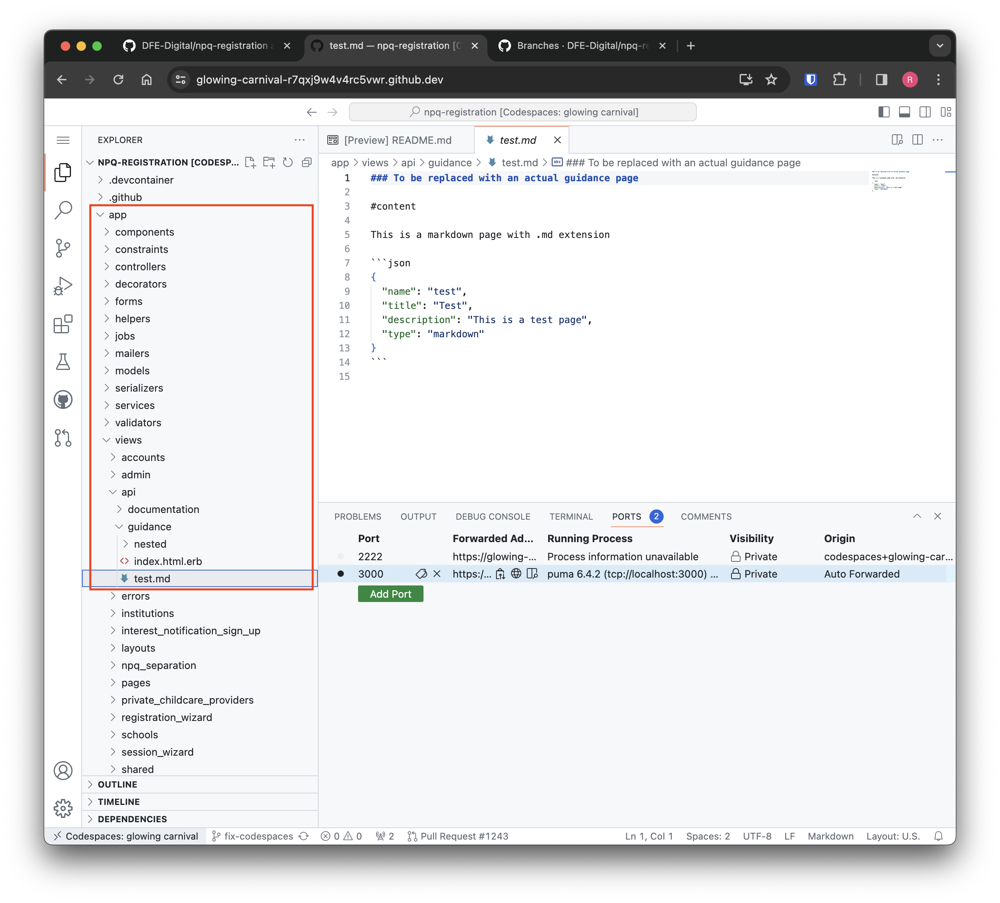
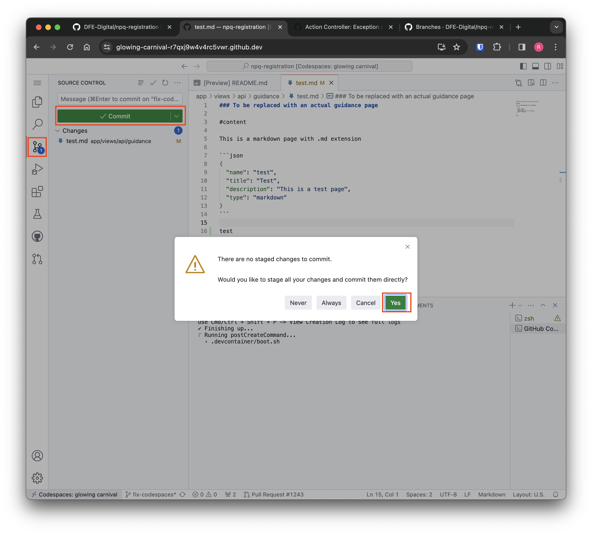
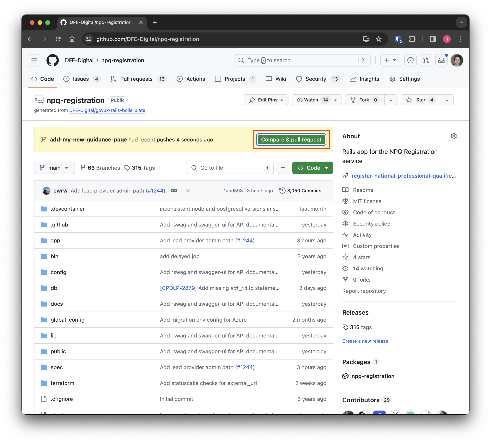

[< Back to Navigation](../README.md)

# API Guidance Pages

This document is designed to assist content editors with making changes to the API guidance pages. The general steps to make changes to API guidance are:

- [API Guidance Pages](#api-guidance-pages)
  - [Start a Github Codespace](#start-a-github-codespace)
  - [Navigate to/create the Markdown file for the guidance page](#navigate-tocreate-the-markdown-file-for-the-guidance-page)
  - [Construct the page/contents using supported Markdown syntax](#construct-the-pagecontents-using-supported-markdown-syntax)
  - [Preview your changes](#preview-your-changes)
  - [Raise a pull request](#raise-a-pull-request)
  - [Seek approval/merge your changes](#seek-approvalmerge-your-changes)

## Start a Github Codespace

[GitHub Codespaces](https://github.com/features/codespaces) enable you to make changes to the application/guidance pages in a pre-configured environment from within your browser. To use Codespaces you will need:

- A GitHub account (via a tools request in #digital-tools-support on Slack)
- To be part of the DFE-Digital GitHub organization (go to [your organisations list](https://github.com/settings/organizations) and look for DFE-Digital).
- Be granted access to the [npq-registration repository](https://github.com/DFE-Digital/npq-registration).
- Have Codespaces enabled for your account.

Start by creating a branch to work from. You can do this by navigating to the [branches section in the GitHub repository](https://github.com/DFE-Digital/npq-registration/branches) and clicking `New branch`. Here, enter a branch name to describe your changes and click `Create new branch`:

<a href="images/new-branch.png" target="blank"></a>

Now we can switch to our branch by navigating to the [main repository page](https://github.com/DFE-Digital/npq-registration) and selecting the branches drop-down, searching for and choosing our branch:

<a href="images/select-branch.png" target="blank"></a>

Finally, we want to start a Codespace on this branch by clicking `Code` -> `Create codespace on <your branch name>` (you should see "Codespace usage for this repository is paid for by DFE-Digital." in the dialog):

<a href="images/create-codespace.png" target="blank"></a>

The first time you create a Codespace it can take quite a while to spin up. You know its ready when the `PORTS` tab contains a port of `3000`:

<a href="images/create-codespace-finished.png" target="blank"></a>

## Navigate to/create the Markdown file for the guidance page

In order to create/edit a guidance page you have to navigate to the folder that contains the Markdown files that make up each page. Navigate to the `app/views/api/guidance` in the file explorer:

<a href="images/api-guidance-dir.png" target="blank"></a>

Here, you can either find the existing file you want to edit or create a new `.md` file to add a guidance page. The folder structure will mimic the final URL given to the page, for example:

- `app/views/api/guidance/page-1.md` will be available at `/api/guidance/page-1`
- `app/views/api/guidance/nested/page-2.md` will be available at `/api/guidance/nested/page-2`

## Construct the page/contents using supported Markdown syntax

Write the content of the guidance page using Markdown, which we will later transform into HTML. An example page would be:

```
# Main heading

## Sub-heading 1

Some content here

## Sub heading 2

Some more content here with [a link](http://link.com) and a code block:

```json
{
  "name": "test",
  "title": "Test",
  "description": "This is a test page",
  "type": "markdown"
}
```

The sub-headings (any second-level heading) will appear as a link in the sidebar. If you're not familiar with Markdown you can reference [this cheat sheet](https://www.markdownguide.org/cheat-sheet/)

## Preview your changes

When you want to view your changes as they will appear on the website, navigate to the `PORTS` tab in GitHub Codespaces and `right click` -> `Open in browser`. You can then input the path to the guidance page you are editing in the URL of the browser (see [Navigate to/create the Markdown file for the guidance page](#navigate-tocreate-the-markdown-file-for-the-guidance-page) if you're unsure of what the path will be).

## Raise a pull request

When you're happy with your changes, you need to commit them and raise a pull request in GitHub that can be merged down/deployed.

You can do this by navigating to the `Source Control` section of Codespaces and clicking the `Commit` button. If you get a dialog about staging changes, you can select `Yes` or `Always`:

<a href="images/commit-changes.png" target="blank"></a>

Once committed, you can open the [pull requests tab in GitHub](https://github.com/DFE-Digital/npq-registration/pulls) and you should be prompted to create a new pull request:

<a href="images/raise-pr.png" target="blank"></a>

## Seek approval/merge your changes

With your pull request raised, all that's left is to get **a developer** on the team to review your changes. Once reviewed, you will be able to merge the changes and this will deploy them to production.
