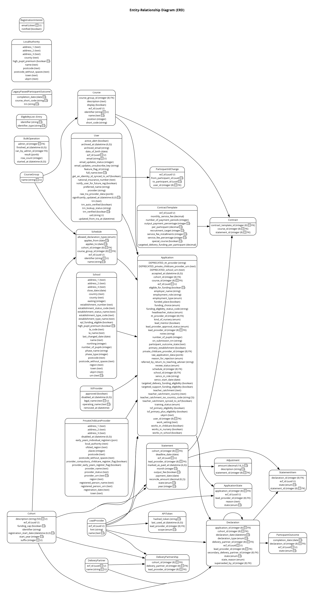

[< Back to Navigation](../README.md)

# Data model

> This document will undoubtedly change and grow as we develop our understanding of the services that this application encapsulates.

## 1. Introduction

This document provides an overview of the data model for the NPQ application. It details the primary entities, their relationships, and the data flow within the application. This model is essential for developers and stakeholders to understand how data is structured, stored, and retrieved.

## 2. Purpose of the Data Model

The data model for storing NPQ data is designed to:

- Facilitate efficient data storage and retrieval.
- Enable the business logic of the application by structuring data relationships.
- Support data integrity, scalability, and performance optimization.

## 3. Entity-Relationship Diagram (ERD)

This diagram represents our current understanding of the data models:

### 3.1 Overview of Key Entities and Relationships

1. **Application** - Central to the model, `Application` connects multiple entities:
   - It has a one-to-one relationship with `User`, `LeadProvider` and `Course`.
   - It has optional relationships with `Cohort`, `Schedule`, `School`, `PrivateChildcareProvider`, and `IttProvider`.
   - It has a one-to-many relationship with `ApplicationStates`, `Declaration` and `ParticipantIdChange` (through `User`).

   `Application` captures various attributes related to a user's employment, funding eligibility, and application status.

2. **User** - Represents individuals applying for courses. Each `User` has an ID, email, and other identifying details, including a teacher reference number.

3. **LeadProvider** - Provides a source for educational leads or courses. LeadProviders are linked to multiple entities:
   - `Application` to associate a lead provider with specific applications.
   - `Declaration` to associate a lead provider with specific declarations.
   - `Statement` to track declarations and cohorts per provider.
   - `ApiToken` to allow access via API, with security tracking through hashed tokens and last used timestamps.

4. **Course** - Represents educational courses available for application.
   - Linked to `Application` to assign a course to an application.
   - Connected to `CourseGroup` to organize courses by group and associate with `Schedule`.

5. **Schedule** - Details the scheduling for different course groups and cohorts, including key dates like the start and application period for declarations.

6. **Cohort** - Represents a group of participants starting in a given year. It links with:
   - `Application`, `Declaration`, `Schedule` and `Statement`, to track cohorts across applications, declarations, schedules and statements.

7. **Declaration and Statement** - These entities track user declarations and statements associated with lead providers:
   - `Declaration` links to `Application`, `Cohort` and `ParticipantOutcome`, tracking users' declaration states and types.
   - `Statement` relates to `LeadProvider` and `Cohort` to represent payment deadlines, states, and reconciliation amounts.

8. **Contract and ContractTemplate** - Defines the contractual relationships and terms related to statements and courses:
   - `Contract` links `Statement`, `Course`, and `ContractTemplate`.
   - `ContractTemplate` captures detailed payment and service fee structures.

9. **ParticipantOutcome** - Tracks user outcomes tied to declarations, including the outcome state and completion date.

10. **Auxiliary Entities**
    - `School`, `PrivateChildcareProvider`, and `IttProvider` allow additional relationships with applications.
    - `ApiToken` enables secure API access for lead providers.
    - `ParticipantIdChange` keeps a record of changes in participant IDs for `User`.
    - `ApplicationState` keeps a record per change in the state of an `Application`.

## 4. Data Flow and Key Processes

This data model supports a structured system for NPQ applications, participant declarations, provider statements, and contractual processes. Here's a high-level overview of the data flow and key processes:

### 4.1. **Application Submission Process**

   - **Data Entry**: A user (`User`) submits an `Application` for a `Course` offered by a `LeadProvider`.
   - **Entity Interactions**: When an `Application` is created, it references:
     - The `User` applying.
     - The specific `Course` and `Cohort` applied for.
     - A specific `Schedule` when the `Application` is accepted by a `LeadProvider` (related to timing and cohorts).
     - Optional entities like `School`, `PrivateChildcareProvider`, and `IttProvider`, representing different organizational affiliations or employment details.
   - **Attributes**: The `Application` includes data on eligibility, funding, role, approval, and training status. This information is essential for tracking the participant's suitability and funding options.

   This application data flows to downstream entities that track the participant's progress and outcomes.

### 4.2. **Course Scheduling and Cohort Management**

   - **Data Organization**: Courses (`Course`) are organized into `CourseGroup`s, which are further linked to specific `Schedule`s. `Schedule` connects each `CourseGroup` with `Cohort` entities that denote specific time frames, ensuring applications align with course timings.
   - **Cohort Management**: The `Cohort` entity represents the year or session in which a group of participants starts. Each cohort can be associated with multiple applications and helps manage different program batches.

   This organization ensures that courses are managed and tracked by cohorts and groups, making it easy to allocate schedules and track cohort-specific declarations and outcomes.

### 4.3. **Declaration and Statement Process**

   - **Declarations**: As users participate in courses, they make progress and fulfill specific requirements represented by `Declaration` entities.
     - **Attributes**: Each `Declaration` has a state (e.g., submitted, eligible, payable), type, and declaration date.
     - **Association**: `Declaration` is linked to `Application`, allowing the system to track a participant's journey through different declarations.
     - **Outcome Tracking**: A `ParticipantOutcome` entity links to `Declaration`, capturing the outcome and completion status of the user's declaration.

   - **Statements**: `Statement`s track financial aspects of user declarations for each `LeadProvider` and `Cohort`.
     - **Attributes**: Each `Statement` has attributes for financial reconciliation, deadlines, payment states, and provider-specific data.
     - **Items Tracking**: `StatementItem`s are associated with `Declaration`s and store the state of each declaration as part of the statement.

   This declaration-statement process captures user progress and facilitates reporting for providers, helping reconcile payments and manage declarations.

### 4.4. **Contractual and Financial Tracking**

   - **Contracts**: The `Contract` entity defines agreements between the educational system, providers, and courses. It ties into `Statement`, `Course`, and `ContractTemplate`.
   - **Templates**: Each `ContractTemplate` specifies payment terms, including service fees, participant fees, recruitment targets, and payment periods.
   - **Financial Flow**: `ContractTemplate` ensures that each `Contract` and `Statement` aligns with predefined financial terms, facilitating accurate budget and payment management.

   This financial tracking process ensures contractual compliance, accurate billing, and budget management across providers and courses.

### 4.5. **User and Provider Management**

   - **User ID Management**: `ParticipantIdChange` enables the tracking of changes in user (`User`) identifiers, essential for maintaining a clear user history.
   - **API Access**: `ApiToken` allows `LeadProvider`s secure access to the system via hashed tokens, facilitating data access for providers while ensuring security.

   These auxiliary processes help maintain user data integrity and allow providers secure access to manage applications and declarations.

#### Key Data Flow Summary:

1. **Application Creation** ➔ Triggers cohort association for user applications.
2. **Application Acceptance** ➔ Triggers schedule association for user applications.
3. **Declaration Submission** ➔ Captures user progress and outcomes, feeding into statements for financial tracking.
4. **Statement and Contract Processing** ➔ Ensures compliance with financial terms for providers, courses, and user declarations.
5. **Provider and User Management** ➔ Supports secure provider access and accurate user tracking across application processes.

### Overall Workflow

1. **User applies** for a course through an `Application`, selecting relevant provider.
2. **Provider accepts** an `Application`, optionally selecting relevant schedule and funded place status.
3. **Declarations** are made based on user progress, feeding into statements and tracking outcomes.
4. **Statements** and **Contracts** manage finances, ensuring terms are met.
5. **Providers** access data through `ApiToken`, while user identifiers are tracked to ensure data accuracy.

## 5. Notes

* Document on `NPQ Contract` can be found [here](npq_contracts.md).
