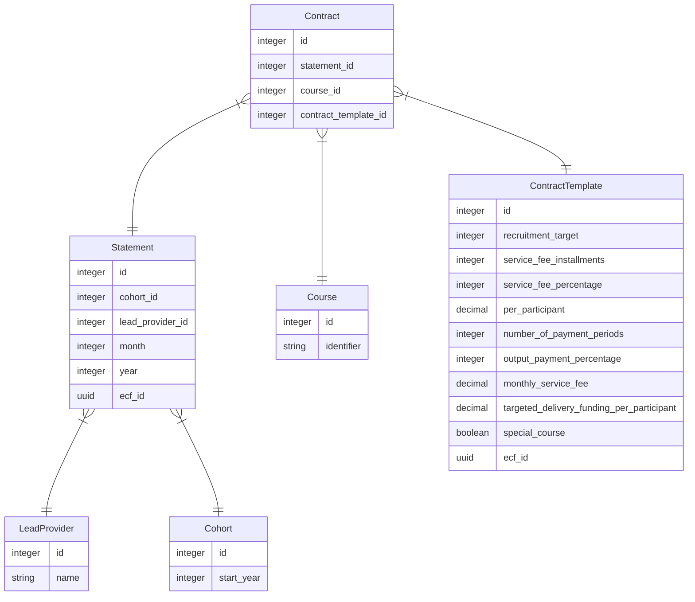

# NPQ Contracts

NPQ Contract holds values that are used to calculate monthly financial statements for a lead provider and cohort.

## Schema Design



A `Statement` has many `Contract`, one for each `Course`.

`Contract` belongs to a `ContractTemplate`, which holds contract values
for statement calculation.

## Updating Contract Values

The following code snippet is used to update contract values for a specific cohort and lead provider within a given month and year:

* **Select statements:** Select statements to update based on the lead_provider, cohort, month and year
* **Find contract:** For each course, find the associated contract.
* **Duplicate and modify template:** Duplicate existing contract template and make the changes (e.g., `recruitment_target` is set to 500).
* **Update contract:** Update contract to the new contract template.

```ruby
Statement.where(lead_provider:, cohort:, month: 1, year: 2023).each do |statement|
  course = Course.where(identifier: "npq-leading-teaching").first
  contract = statement.contracts.where(course: course).first
  old_template = contract.contract_template
  new_template = ContractTemplate.create(
    special_course: old_template.special_course,
    per_participant: old_template.per_participant,
    output_payment_percentage: old_template.output_payment_percentage,
    number_of_payment_periods: old_template.number_of_payment_periods,
    service_fee_percentage: old_template.service_fee_percentage,
    service_fee_installments: old_template.service_fee_installments,
    recruitment_target: 500
  )
  contract.contract_template = new_template
  contract.save!
end
```

## Notes

* Spike discussion can be found here: <https://dfedigital.atlassian.net/browse/CPDLP-3328>
* Previous `npq-separation` discussion here: <https://github.com/DFE-Digital/npq-separation/blob/main/statement-contracts-modelling.md>
