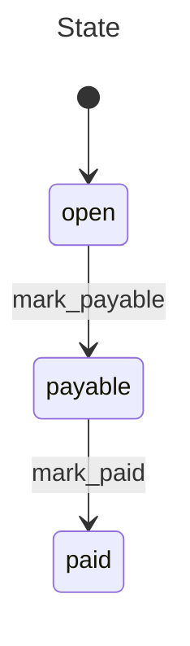
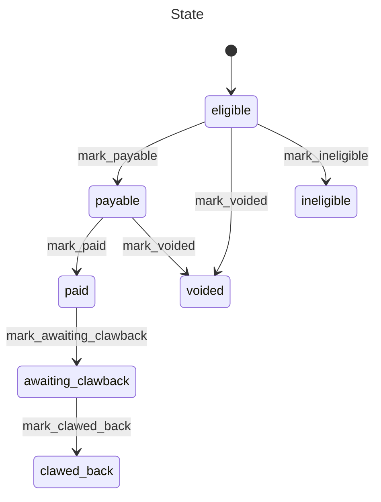
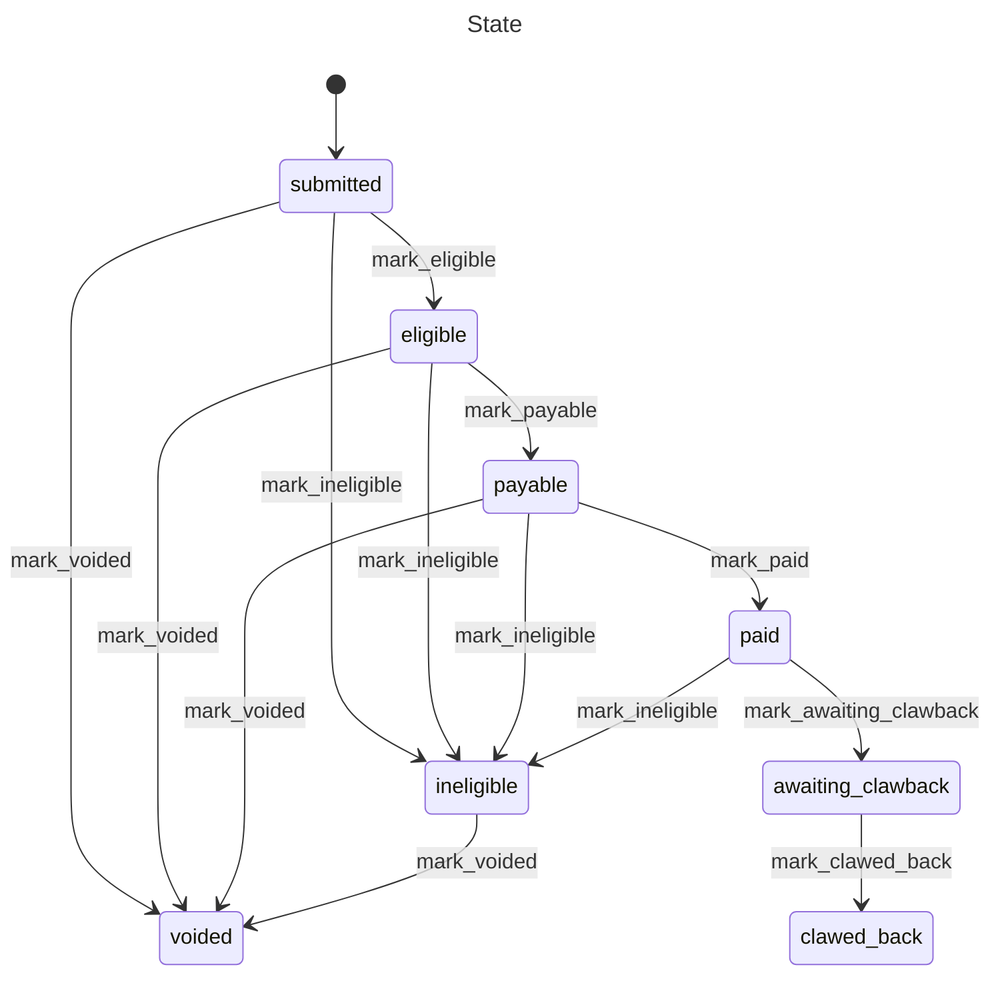

# State Machines

## Statement

```mermaid
---
title: State
---
stateDiagram-v2
    [*] --> open
    open --> payable: mark_payable
    payable --> paid: mark_paid
```

## StatementItem

```mermaid
---
title: State
---
stateDiagram-v2
    eligible
    payable
    paid
    voided
    ineligible
    awaiting_clawback
    clawed_back

    [*] --> eligible
    eligible --> payable: mark_payable
    payable --> paid: mark_paid
    eligible --> voided: mark_voided
    payable --> voided: mark_voided
    paid --> awaiting_clawback: mark_awaiting_clawback
    awaiting_clawback --> clawed_back: mark_clawed_back
    eligible --> ineligible: mark_ineligible
```

## Declaration

```mermaid
---
title: State
---
stateDiagram-v2
    submitted
    eligible
    payable
    paid
    voided
    ineligible
    awaiting_clawback
    clawed_back

    [*] --> submitted
    submitted --> eligible: mark_eligible
    eligible --> payable: mark_payable
    payable --> paid: mark_paid
    submitted --> ineligible: mark_ineligible
    eligible --> ineligible: mark_ineligible
    payable --> ineligible: mark_ineligible
    paid --> ineligible: mark_ineligible
    paid --> awaiting_clawback: mark_awaiting_clawback
    awaiting_clawback --> clawed_back: mark_clawed_back
    submitted --> voided: mark_voided
    eligible --> voided: mark_voided
    payable --> voided: mark_voided
    ineligible --> voided: mark_voided
```
